# Aplicação de Padrão de Projeto — Restaurante Sakura

**Faculdade de Educação Tecnológica do Estado do Rio de Janeiro**

Davy Andrade Moura
Derek Gossani Teixeira da Silva

Rio de Janeiro — 2026

---

## 1. Introdução

A construção de um software de qualidade é um processo análogo ao planejamento de uma edificação, exigindo arquitetura e ferramentas precisas para garantir o sucesso do projeto. Nesse contexto, a modelagem de sistemas surge como uma atividade essencial que permite a criação de modelos abstratos, os quais funcionam como simplificações da realidade para facilitar o entendimento de sistemas complexos. A utilização de modelos ajuda a visualizar a estrutura e o comportamento desejados, servindo como um guia para a construção e documentação das decisões de projeto.

Um dos pilares dessa prática é a **abstração**, processo seletivo que isola os aspectos importantes de um problema e suprime os detalhes irrelevantes para um determinado propósito. Para padronizar essa comunicação e organização, utiliza-se a **UML** (Unified Modeling Language), uma linguagem padrão que permite visualizar, especificar e documentar artefatos de software sob diferentes perspectivas, facilitando a interação entre os membros da equipe e o cliente. Além disso, a modelagem pode seguir uma arquitetura dirigida, como a **MDA** (Model Driven Architecture), que organiza o desenvolvimento em níveis: o **CIM**, focado nos requisitos e independente de computação; o **PIM**, que descreve o negócio de forma independente de tecnologia; e o **PSM**, que detalha a implementação em plataformas específicas.

## 2. O Minimundo

O Restaurante Sakura busca a implementação do **Sakura Management System** para resolver gargalos críticos de comunicação entre o salão e o sushibar. É importante ressaltar que o gerenciamento de reservas de mesas já é realizado por uma plataforma externa preexistente; portanto, **o escopo deste novo sistema não inclui a funcionalidade de reserva**, concentrando-se exclusivamente no fluxo operacional a partir do momento em que o cliente ocupa a mesa.

O sistema deve atuar no terminal touchscreen de cada mesa. O cliente inicia sua interação navegando pelo cardápio digital (com fotos, ingredientes e valores nutricionais). Ao selecionar um prato, o pedido entra em estado **"Pendente"** até que o Garçom faça a validação física da disponibilidade dos insumos. Somente após essa validação, o pedido é enviado ao terminal de visualização do Sushiman.

O sushiman gerencia a produção e, ao finalizar o prato, o sistema deve realizar a **baixa automática do estoque** de insumos por porção. Ao término da refeição, o cliente solicita o fechamento pelo terminal e o Caixa processa o pagamento (Pix, Cartão ou Dinheiro), emitindo o cupom e liberando a mesa. O Gerente utiliza o sistema apenas para ajustes manuais de inventário e supervisão do cardápio.

### 2.1. Operação de Atendimento (Salão)

- **RN01 – Fronteira de Reservas:** O sistema não processa agendamentos. A ocupação de mesas reservadas externamente deve ser refletida no sistema apenas no momento da chegada do cliente, através da abertura da mesa pelo garçom ou recepcionista.
- **RN02 – Status e Abertura de Mesa:** Uma mesa só pode ser aberta e vinculada a um consumo se o seu status atual for "Livre". Ao ser aberta, o sistema deve alterar automaticamente seu estado para "Ocupada", bloqueando novas aberturas até o encerramento da conta.
- **RN03 – Chamada de Suporte:** O terminal touchscreen da mesa deve permitir que o cliente envie uma notificação de "Ajuda" diretamente para o dispositivo móvel ou terminal do garçom responsável, garantindo a agilidade no suporte presencial.

### 2.2. Pedidos e Produção (Sushibar)

- **RN04 – Detalhamento do Cardápio:** O cardápio digital deve apresentar de forma autônoma o preço, a lista de ingredientes e os valores nutricionais (calorias e alérgenos) de cada prato, visando a transparência total ao consumidor.
- **RN05 – Validação Obrigatória de Estoque:** Todo pedido iniciado pelo cliente no terminal permanece em estado "Aguardando Validação". O envio para a fila do sushibar (KDS) só ocorre após a confirmação física do Garçom, que deve validar se os insumos perecíveis estão disponíveis no momento.
- **RN06 – Gestão de Fila (KDS):** O terminal do Sushiman deve exibir os pedidos validados em ordem cronológica de chegada. O sistema deve permitir a alteração manual do status do prato para "Em Preparo" e "Pronto".
- **RN07 – Alerta de Retirada:** Assim que o Sushiman marcar um item como "Pronto" no terminal, o sistema deve disparar um alerta visual e sonoro imediato para o garçom responsável pela entrega.

### 2.3. Gestão de Estoque e Menu

- **RN08 – Baixa Automática de Insumos:** Ao finalizar a preparação (status "Pronto"), o sistema deve realizar a baixa automática das porções unitárias de ingredientes vinculadas à ficha técnica do prato no banco de dados.
- **RN09 – Atualização Dinâmica do Menu:** O Sushiman possui autonomia para desativar ou reativar pratos no cardápio digital em tempo real. Caso um insumo crítico (como o salmão) atinja o nível zero, o sistema deve impedir novos pedidos dos pratos relacionados.
- **RN10 – Auditoria de Inventário:** Ajustes manuais no estoque, para correção de divergências entre o físico e o digital, são de uso exclusivo do Gerente, mediante autenticação administrativa.

### 2.4. Fluxo Financeiro e Fechamento

- **RN11 – Centralização de Pagamento:** Embora o cliente possa solicitar a conta pelo terminal da mesa, o processamento financeiro e a emissão do cupom fiscal são atividades exclusivas do Caixa, garantindo o controle sobre a transação.
- **RN12 – Flexibilidade de Meios:** O sistema deve estar preparado para registrar e processar pagamentos via Pix, Cartão (Crédito/Débito) e Dinheiro, permitindo também o fechamento parcial ou dividido da conta.
- **RN13 – Ciclo de Liberação:** O status de uma mesa só retornará para "Livre" no mapa do restaurante após a confirmação do pagamento integral e o encerramento do pedido no terminal do Caixa.

## 3. Escopo do Sistema

O Restaurante Sakura busca o desenvolvimento do Sakura Management System para otimizar suas operações internas, focando na precisão do fluxo de informações entre o salão e o sushibar. É fundamental estabelecer, por meio do processo de abstração, que o gerenciamento de reservas já é realizado por uma plataforma externa consolidada, de modo que este novo sistema não deve abranger funcionalidades de agendamento, limitando-se ao ciclo operacional que se inicia estritamente no momento em que a mesa é ocupada. No salão, cada mesa disporá de um dispositivo touchscreen para que o cliente consulte de forma autônoma o cardápio digital, incluindo preços, ingredientes e detalhes como o valor nutricional de cada iguaria.

O fluxo de atendimento dita que, ao realizar um pedido, este entra em estado pendente até que o Garçom valide fisicamente a disponibilidade dos insumos na cozinha, atuando como um filtro para evitar pedidos de itens esgotados. Somente após essa validação humana, a solicitação é enviada ao terminal de visualização (KDS) do Sushiman, que gerencia a fila de produção por ordem cronológica e atualiza o status dos pratos conforme o progresso. No momento em que o sushiman finaliza a preparação, o sistema deve realizar a baixa automática no estoque por porção unitária, garantindo um controle rigoroso de insumos perecíveis.

Ao término da refeição, o cliente solicita o fechamento da conta pelo terminal, mas o processamento financeiro é de responsabilidade exclusiva do Caixa, que deve suportar pagamentos via Pix, cartão ou dinheiro para liberar a mesa no mapa do restaurante. O Gerente detém o acesso administrativo para supervisionar o cardápio e realizar ajustes manuais no inventário sempre que houver divergências entre o estoque físico e o digital.

Este mini-mundo compila o entendimento das regras de negócio necessárias para que a modelagem subsequente — incluindo diagramas de casos de uso e de classes — reflita fielmente a realidade operacional pretendida, evitando ambiguidades no desenvolvimento do software.

## 4. Níveis de Modelagem

O desenvolvimento do Sakura Management System fundamenta-se na arquitetura **Model Driven Architecture (MDA)**, proposta pelo Object Management Group (OMG), que utiliza modelos como artefatos centrais para direcionar o ciclo de vida do software, garantindo que a complexidade operacional do restaurante seja traduzida em soluções técnicas precisas. Esta abordagem permite particionar o problema em diferentes níveis de abstração, isolando aspectos importantes e facilitando a compreensão e a comunicação padronizada entre todos os envolvidos no projeto.

**CIM (Modelo Independente de Computação):** o foco reside na análise de requisitos e nas regras de negócio sob a perspectiva do domínio. Para o Sakura, o CIM estabelece uma política de segurança operacional crítica: caso ocorra uma falha na conexão com a base de dados ou instabilidade severa, o sistema deve entrar em **estado de bloqueio (trava) por segurança**, forçando o retorno imediato às operações manuais para evitar a perda de integridade dos pedidos e do estoque. Além disso, o CIM define que o fluxo de atendimento exige a validação presencial do Garçom antes da produção e que o controle de insumos será realizado de forma unitária por porção.

**PIM (Modelo Independente de Plataforma):** formaliza a estrutura e o comportamento do sistema através da UML, com alto grau de abstração e independência tecnológica. O PIM descreve a dinâmica do sistema onde os eventos gerados pelos clientes nas mesas devem produzir estados instantâneos no terminal do sushiman, modelando a interação entre os atores (Cliente, Garçom e Sushiman) como um contrato de comportamento.

**PSM (Modelo Específico de Plataforma):** detalha a implementação tecnológica. O PSM especifica o uso de aplicativos nativos desenvolvidos em frameworks como **React Native** ou **Flutter**, permitindo a integração de código nativo em **Swift** (iOS) ou **Kotlin** (Android) para o gerenciamento de permissões de hardware e otimização de performance. Para o Terminal de Visualização de Pedidos, o PSM define o uso de tecnologias de sincronização instantânea, como **WebSockets**, assegurando que os novos pedidos validados apareçam imediatamente para o sushiman sem a necessidade de atualização manual.

## 5. Atores e Lista de Casos de Uso

### 5.1. Detalhamento dos Atores

**Cliente**
- Principal usuário do terminal touchscreen no salão.
- Responsável por navegar no cardápio e iniciar a intenção de consumo.
- Pode solicitar suporte direto ou auxílio da equipe através do sistema.

**Garçom**
- Atua como o elo de validação entre o salão e a cozinha.
- Verifica a disponibilidade física de insumos antes de confirmar os pedidos no sistema.
- Monitora o status das entregas e o pagamento das mesas sob sua responsabilidade.

**Sushiman (Cozinheiro)**
- Gerencia o fluxo de preparação através do terminal de visualização.
- Atualiza a disponibilidade do cardápio digital com base nos ingredientes do dia.
- Possui visão panorâmica dos insumos disponíveis para planejar a oferta do menu.

**Caixa**
- Responsável exclusivo pelo encerramento financeiro das contas.
- Processa diferentes modalidades de pagamento (Pix, Cartão, Dinheiro).
- Confirma a quitação para que o sistema libere a mesa no mapa do restaurante.

**Gerente**
- Administrador geral do sistema com foco em retaguarda.
- Realiza ajustes manuais de inventário e supervisiona o cadastro de funcionários.
- Analisa o desempenho do negócio através de relatórios de vendas.

### 5.2. Lista Detalhada de Casos de Uso

**UC01. Consultar Cardápio**
- Listagem completa de pratos e bebidas categorizados.
- Exibição de preços, fotos ilustrativas e lista de ingredientes.
- Visualização detalhada de valores nutricionais e alérgenos por item.

**UC02. Realizar Pedido**
- Escolha autônoma de pratos e quantidades pelo cliente.
- Opção de acionamento do garçom para inclusão manual de pedidos.
- Validação de disponibilidade obrigatória realizada pela equipe antes do envio à cozinha.

**UC03. Gerenciar Produção**
- Visualização da fila de pedidos validados em ordem cronológica.
- Atualização do status de preparação: "Pendente", "Em Preparo" e "Pronto".
- Notificação automática ao garçom assim que um prato é finalizado.

**UC04. Atualizar Cardápio**
- Inclusão de novos pratos ou promoções do dia pelo Sushiman.
- Suspensão imediata de itens cujos insumos estejam esgotados.
- Sincronização em tempo real das alterações para todos os terminais das mesas.

**UC05. Ajustar Estoque**
- Monitoramento automático de baixas de insumos conforme a produção.
- Intervenção manual do Gerente para correção de inventário após conferência física.

**UC06. Processar Pagamento**
- Geração da conta detalhada com o resumo do consumo da mesa.
- Seleção do método de pagamento e processamento da transação pelo Caixa.
- Emissão de comprovante e alteração do status da mesa para "Livre".

**UC07. Gerar Relatórios de Vendas**
- Consolidação de dados de faturamento diário, semanal e mensal.
- Exportação de relatórios para auxílio na tomada de decisão gerencial.

## 6. Diagrama de Caso de Uso

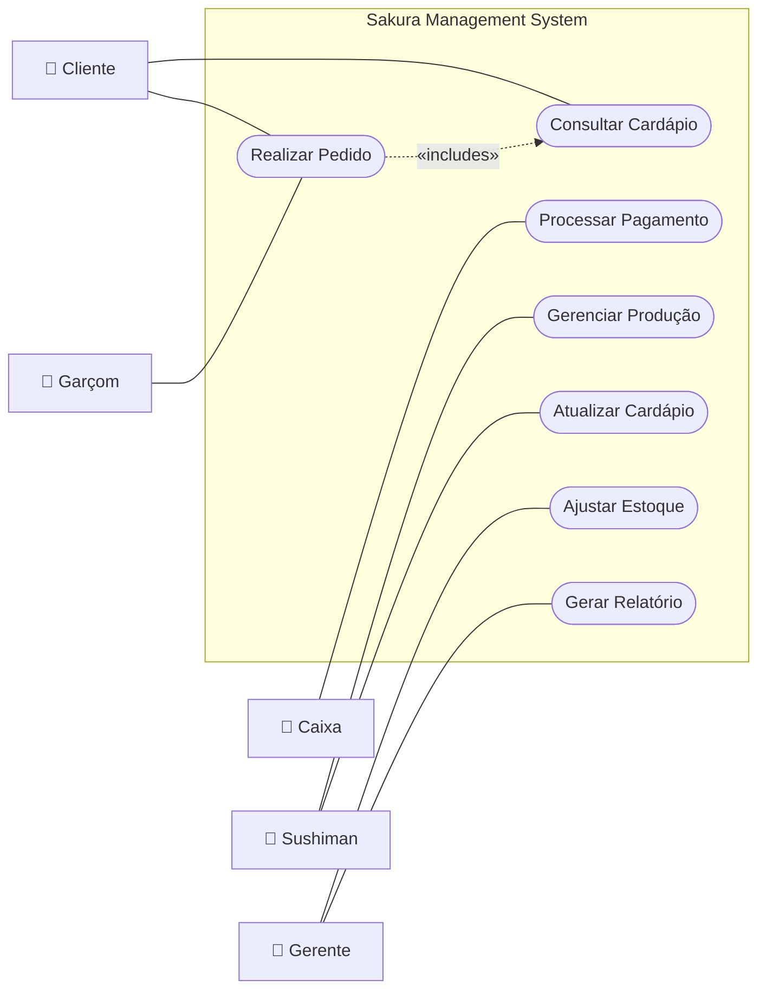
```mermaid
flowchart LR
    Cliente["🧍 Cliente"]
    Garcom["🧍 Garçom"]
    Caixa["🧍 Caixa"]
    Sushiman["🧍 Sushiman"]
    Gerente["🧍 Gerente"]

    subgraph SMS["Sakura Management System"]
        direction LR
        UC01(["Consultar Cardápio"])
        UC02(["Realizar Pedido"])
        UC06(["Processar Pagamento"])
        UC03(["Gerenciar Produção"])
        UC04(["Atualizar Cardápio"])
        UC05(["Ajustar Estoque"])
        UC07(["Gerar Relatório"])
    end

    Cliente --- UC01
    Cliente --- UC02
    Garcom --- UC02
    Caixa --- UC06
    Sushiman --- UC03
    Sushiman --- UC04
    Gerente --- UC05
    Gerente --- UC07

    UC02 -. "«includes»" .-> UC01
```

## 7. Descrição Textual dos Casos de Uso

A descrição textual detalha os "contratos" de comportamento do sistema, especificando as interações entre os atores e o software para garantir a integridade dos processos operacionais.

### UC01. Consultar Cardápio
- **Atores:** Cliente.
- **Pré-condição:** Acesso ao terminal touchscreen da mesa.
- **Fluxo Básico:** 1. O cliente solicita a lista de pratos disponíveis; 2. O sistema apresenta preços, fotos e ingredientes; 3. O cliente solicita o detalhamento nutricional; 4. O sistema exibe o valor nutricional por ingrediente.
- **Fluxos Alternativos:** Item indisponível; o sistema oculta a opção de pedido, permitindo apenas a visualização.
- **Pós-condição:** Informações visualizadas pelo cliente.

### UC02. Realizar Pedido
- **Atores:** Cliente e Garçom.
- **Pré-condição:** Mesa com status "Ocupada".
- **Fluxo Básico:** 1. O cliente seleciona os itens desejados (Inclusão do UC01); 2. O cliente confirma a intenção de pedido; 3. O sistema notifica o Garçom para validação; 4. O Garçom verifica a disponibilidade física dos insumos e valida o pedido no terminal; 5. O sistema envia a solicitação para o sushibar.
- **Fluxos Alternativos:** O cliente solicita ajuda pelo terminal; o sistema alerta o garçom para atendimento presencial antes da conclusão do pedido.
- **Pós-condição:** Pedido enviado para a fila de produção (KDS).

### UC03. Gerenciar Produção
- **Atores:** Sushiman.
- **Pré-condição:** Pedido validado pelo garçom.
- **Fluxo Básico:** 1. O Sushiman visualiza o pedido no terminal; 2. Altera o status para "Em Preparo"; 3. Ao finalizar, altera para "Pronto"; 4. O sistema dispara a baixa automática no estoque e notifica o garçom para entrega.
- **Fluxos Alternativos:** Falha de conexão ou instabilidade; o sistema entra em estado de bloqueio por segurança (CIM), e o sushiman assume o controle manual via comanda física para evitar perda de dados.
- **Pós-condição:** Prato pronto para ser servido.

### UC04. Atualizar Cardápio
- **Atores:** Sushiman.
- **Pré-condição:** Autenticação no terminal de produção.
- **Fluxo Básico:** 1. O sushiman acessa a gestão do menu; 2. O sistema exibe os pratos cadastrados; 3. O sushiman adiciona "Pratos do Dia" ou ativa itens sazonais; 4. O sistema sincroniza a atualização com todos os terminais das mesas.
- **Fluxos Alternativos:** Falta de insumo crítico; o sushiman suspende o item temporariamente; o sistema desabilita o prato no cardápio digital instantaneamente.
- **Pós-condição:** Cardápio digital atualizado.

### UC05. Ajustar Estoque
- **Atores:** Gerente.
- **Pré-condição:** Acesso ao módulo administrativo.
- **Fluxo Básico:** 1. O Gerente visualiza o saldo de estoque calculado automaticamente; 2. Identifica divergências após conferência física; 3. O Gerente insere o ajuste manual; 4. O sistema atualiza o saldo de insumos por porção.
- **Fluxos Alternativos:** Nível de estoque crítico; o sistema sugere a geração de um pedido de reposição para fornecedores.
- **Pós-condição:** Inventário sincronizado com a realidade física.

### UC06. Processar Pagamento
- **Atores:** Caixa e Cliente.
- **Pré-condição:** Consumo finalizado e conta solicitada.
- **Fluxo Básico:** 1. O Cliente solicita o fechamento pelo terminal; 2. O sistema notifica o Caixa com o extrato detalhado; 3. O Cliente efetua o pagamento no balcão (Pix, Cartão ou Dinheiro); 4. O Caixa confirma o recebimento; 5. O sistema emite o cupom e altera o status da mesa para "Livre".
- **Fluxos Alternativos:** Pagamento dividido; o Caixa registra as frações de cada cliente até a quitação total da conta.
- **Pós-condição:** Mesa liberada e transação financeira registrada.

### UC07. Gerar Relatórios de Vendas
- **Atores:** Gerente.
- **Pré-condição:** Existência de transações no período solicitado.
- **Fluxo Básico:** 1. O Gerente seleciona o período e o tipo de relatório; 2. O sistema consolida os dados de vendas, pratos mais pedidos e giro de estoque; 3. O sistema exibe os indicadores para suporte à decisão.
- **Fluxos Alternativos:** Filtro sem dados; o sistema informa que não houve movimentação no período selecionado.
- **Pós-condição:** Relatório gerencial emitido para análise.

## 8. Diagrama de Classes

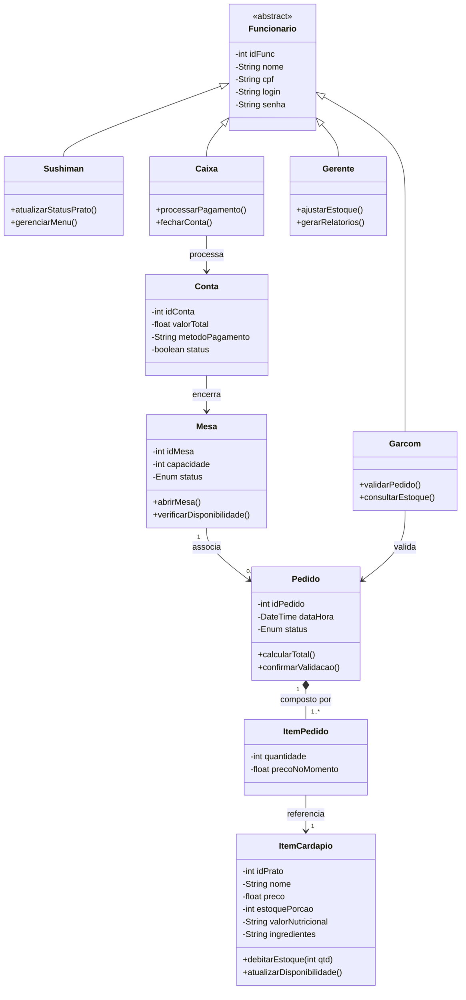
```mermaid
classDiagram
    class Funcionario {
        <<abstract>>
        -int idFunc
        -String nome
        -String cpf
        -String login
        -String senha
    }
    class Garcom {
        +validarPedido()
        +consultarEstoque()
    }
    class Sushiman {
        +atualizarStatusPrato()
        +gerenciarMenu()
    }
    class Caixa {
        +processarPagamento()
        +fecharConta()
    }
    class Gerente {
        +ajustarEstoque()
        +gerarRelatorios()
    }
    Funcionario <|-- Garcom
    Funcionario <|-- Sushiman
    Funcionario <|-- Caixa
    Funcionario <|-- Gerente

    class Mesa {
        -int idMesa
        -int capacidade
        -Enum status
        +abrirMesa()
        +verificarDisponibilidade()
    }
    class Pedido {
        -int idPedido
        -DateTime dataHora
        -Enum status
        +calcularTotal()
        +confirmarValidacao()
    }
    class ItemPedido {
        -int quantidade
        -float precoNoMomento
    }
    class ItemCardapio {
        -int idPrato
        -String nome
        -float preco
        -int estoquePorcao
        -String valorNutricional
        -String ingredientes
        +debitarEstoque(int qtd)
        +atualizarDisponibilidade()
    }
    class Conta {
        -int idConta
        -float valorTotal
        -String metodoPagamento
        -boolean status
    }

    Caixa --> Conta : processa
    Conta --> Mesa : encerra
    Mesa "1" --> "0..*" Pedido : associa
    Pedido "1" *-- "1..*" ItemPedido : composto por
    ItemPedido --> "1" ItemCardapio : referencia
    Garcom --> Pedido : valida
```

O Diagrama de Classes do Sakura Management System descreve a estrutura estática do restaurante físico, detalhando as classes, seus atributos e as operações que caracterizam cada componente do sistema em um determinado instante. A arquitetura centra-se na interação entre objetos para refletir as regras de negócio do mini-mundo operacional. No topo da organização de pessoal, o sistema utiliza o mecanismo de **generalização**, ou herança, a partir da classe abstrata `Funcionario`. Esta classe define atributos privados comuns — identificação, nome, CPF e credenciais de acesso — que são herdados por todas as funções especializadas, garantindo o **encapsulamento** dos dados. As classes filhas representam os papéis específicos do restaurante: `Garcom`, que possui métodos para validar pedidos e consultar a disponibilidade de estoque; `Sushiman`, focado em gerenciar o cardápio e atualizar o status de produção; `Caixa`, responsável pelo processamento de pagamentos e fechamento de contas; e `Gerente`, com permissões para emitir relatórios de vendas e realizar ajustes manuais de inventário.

O núcleo operacional é estruturado em torno da entidade `Mesa`, que monitora sua capacidade e status físico, transitando entre os estados Livre e Ocupada. A `Mesa` mantém uma associação com o `Pedido`, indicando que uma mesa pode gerar diversos pedidos ao longo de um expediente. O `Pedido` atua como agregador do consumo, possuindo uma relação de **composição** com a classe `ItemPedido` — um relacionamento "todo-parte" forte, em que os itens de um pedido estão estritamente vinculados ao seu ciclo de vida e não possuem existência independente. Cada `ItemPedido` faz uma referência direta ao `ItemCardapio` para obter dados como preço e o estoque de porções, atributo privado crucial para que o garçom valide a disponibilidade real antes da confirmação à cozinha. Ao final do consumo, a classe `Conta` consolida o valor total e o método de pagamento, sendo processada pelo `Caixa` para realizar o fechamento financeiro e liberar a `Mesa` para novos clientes.

## 9. Diagramas de Sequência

### 9.1. UC01 — Consultar Cardápio

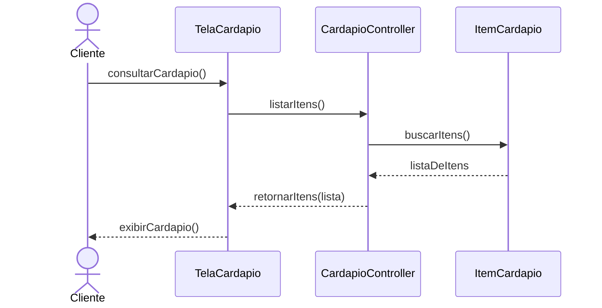
```mermaid
sequenceDiagram
    actor Cliente
    participant TelaCardapio as TelaCardapio
    participant CardapioController as CardapioController
    participant ItemCardapio as ItemCardapio

    Cliente->>TelaCardapio: consultarCardapio()
    TelaCardapio->>CardapioController: listarItens()
    CardapioController->>ItemCardapio: buscarItens()
    ItemCardapio-->>CardapioController: listaDeItens
    CardapioController-->>TelaCardapio: retornarItens(lista)
    TelaCardapio-->>Cliente: exibirCardapio()
```

### 9.2. UC02 — Realizar Pedido

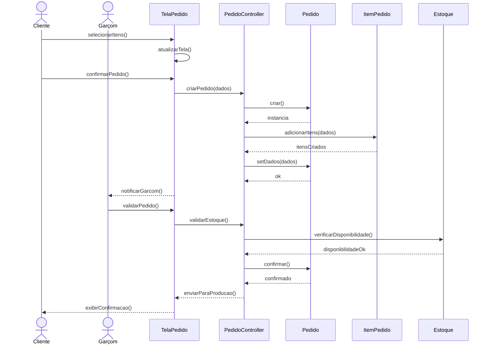
```mermaid
sequenceDiagram
    actor Cliente
    actor Garcom as Garçom
    participant TelaPedido
    participant PedidoController
    participant Pedido
    participant ItemPedido
    participant Estoque

    Cliente->>TelaPedido: selecionarItens()
    TelaPedido->>TelaPedido: atualizarTela()
    Cliente->>TelaPedido: confirmarPedido()
    TelaPedido->>PedidoController: criarPedido(dados)
    PedidoController->>Pedido: criar()
    Pedido-->>PedidoController: instancia
    PedidoController->>ItemPedido: adicionarItens(dados)
    ItemPedido-->>PedidoController: itensCriados
    PedidoController->>Pedido: setDados(dados)
    Pedido-->>PedidoController: ok
    TelaPedido-->>Garcom: notificarGarcom()
    Garcom->>TelaPedido: validarPedido()
    TelaPedido->>PedidoController: validarEstoque()
    PedidoController->>Estoque: verificarDisponibilidade()
    Estoque-->>PedidoController: disponibilidadeOk
    PedidoController->>Pedido: confirmar()
    Pedido-->>PedidoController: confirmado
    PedidoController-->>TelaPedido: enviarParaProducao()
    TelaPedido-->>Cliente: exibirConfirmacao()
```

### 9.3. UC03 — Gerenciar Produção

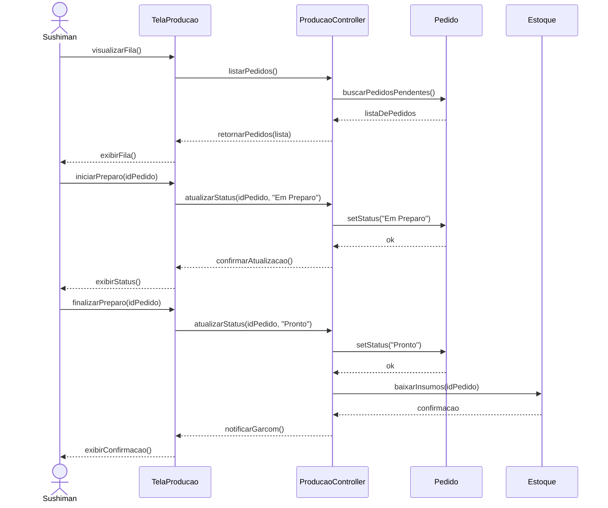
```mermaid
sequenceDiagram
    actor Sushiman
    participant TelaProducao
    participant ProducaoController
    participant Pedido
    participant Estoque

    Sushiman->>TelaProducao: visualizarFila()
    TelaProducao->>ProducaoController: listarPedidos()
    ProducaoController->>Pedido: buscarPedidosPendentes()
    Pedido-->>ProducaoController: listaDePedidos
    ProducaoController-->>TelaProducao: retornarPedidos(lista)
    TelaProducao-->>Sushiman: exibirFila()
    Sushiman->>TelaProducao: iniciarPreparo(idPedido)
    TelaProducao->>ProducaoController: atualizarStatus(idPedido, "Em Preparo")
    ProducaoController->>Pedido: setStatus("Em Preparo")
    Pedido-->>ProducaoController: ok
    ProducaoController-->>TelaProducao: confirmarAtualizacao()
    TelaProducao-->>Sushiman: exibirStatus()
    Sushiman->>TelaProducao: finalizarPreparo(idPedido)
    TelaProducao->>ProducaoController: atualizarStatus(idPedido, "Pronto")
    ProducaoController->>Pedido: setStatus("Pronto")
    Pedido-->>ProducaoController: ok
    ProducaoController->>Estoque: baixarInsumos(idPedido)
    Estoque-->>ProducaoController: confirmacao
    ProducaoController-->>TelaProducao: notificarGarcom()
    TelaProducao-->>Sushiman: exibirConfirmacao()
```

### 9.4. UC04 — Atualizar Cardápio

#### 9.4.1. Adicionar Item ao Cardápio

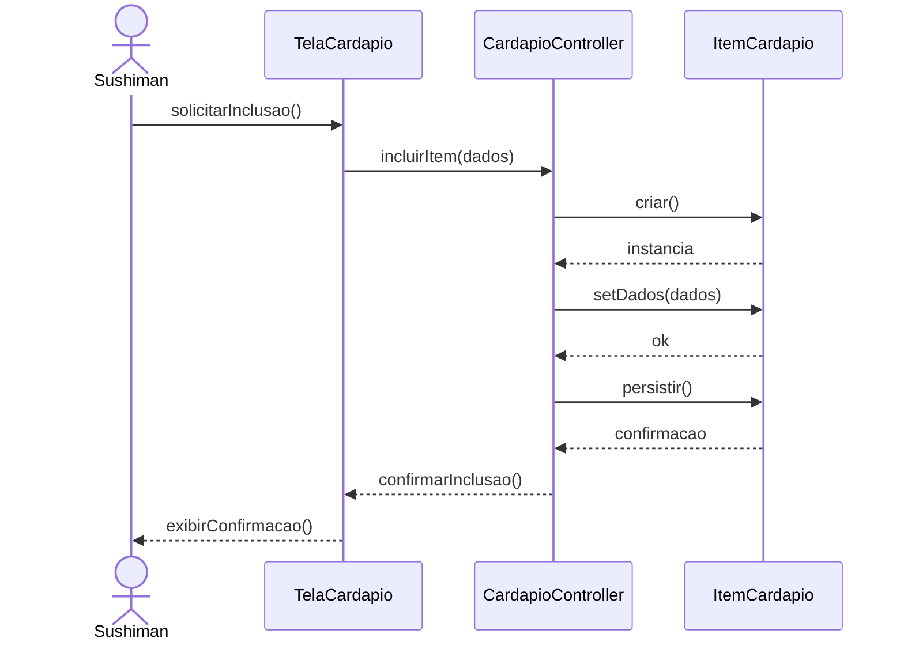
```mermaid
sequenceDiagram
    actor Sushiman
    participant TelaCardapio
    participant CardapioController
    participant ItemCardapio

    Sushiman->>TelaCardapio: solicitarInclusao()
    TelaCardapio->>CardapioController: incluirItem(dados)
    CardapioController->>ItemCardapio: criar()
    ItemCardapio-->>CardapioController: instancia
    CardapioController->>ItemCardapio: setDados(dados)
    ItemCardapio-->>CardapioController: ok
    CardapioController->>ItemCardapio: persistir()
    ItemCardapio-->>CardapioController: confirmacao
    CardapioController-->>TelaCardapio: confirmarInclusao()
    TelaCardapio-->>Sushiman: exibirConfirmacao()
```

#### 9.4.2. Atualizar Item do Cardápio

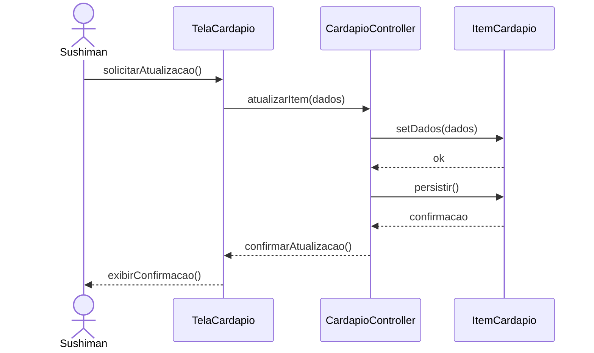
```mermaid
sequenceDiagram
    actor Sushiman
    participant TelaCardapio
    participant CardapioController
    participant ItemCardapio

    Sushiman->>TelaCardapio: solicitarAtualizacao()
    TelaCardapio->>CardapioController: atualizarItem(dados)
    CardapioController->>ItemCardapio: setDados(dados)
    ItemCardapio-->>CardapioController: ok
    CardapioController->>ItemCardapio: persistir()
    ItemCardapio-->>CardapioController: confirmacao
    CardapioController-->>TelaCardapio: confirmarAtualizacao()
    TelaCardapio-->>Sushiman: exibirConfirmacao()
```

#### 9.4.3. Remover Item do Cardápio

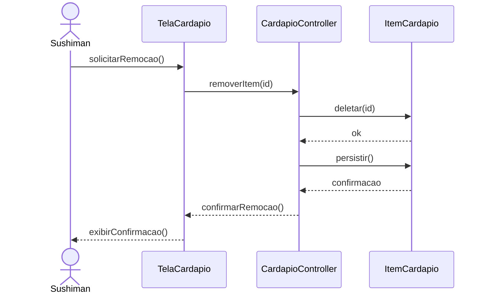
```mermaid
sequenceDiagram
    actor Sushiman
    participant TelaCardapio
    participant CardapioController
    participant ItemCardapio

    Sushiman->>TelaCardapio: solicitarRemocao()
    TelaCardapio->>CardapioController: removerItem(id)
    CardapioController->>ItemCardapio: deletar(id)
    ItemCardapio-->>CardapioController: ok
    CardapioController->>ItemCardapio: persistir()
    ItemCardapio-->>CardapioController: confirmacao
    CardapioController-->>TelaCardapio: confirmarRemocao()
    TelaCardapio-->>Sushiman: exibirConfirmacao()
```

### 9.5. UC05 — Ajustar Estoque

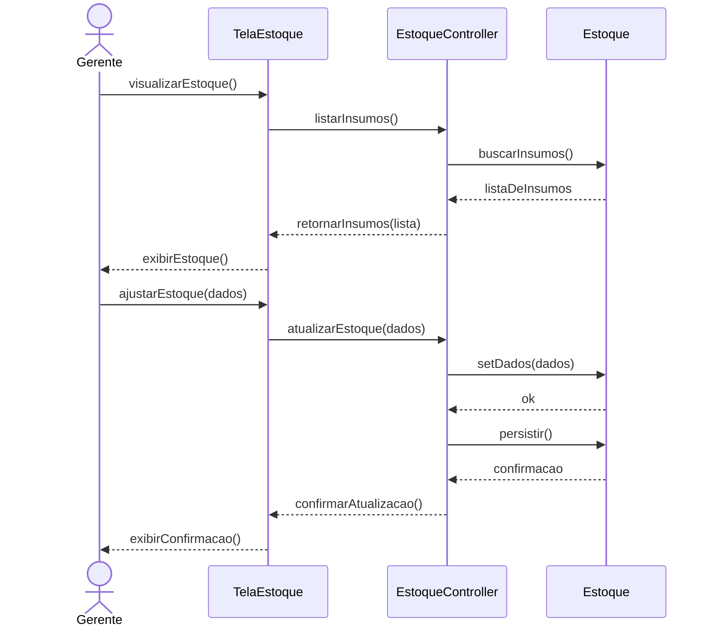
```mermaid
sequenceDiagram
    actor Gerente
    participant TelaEstoque
    participant EstoqueController
    participant Estoque

    Gerente->>TelaEstoque: visualizarEstoque()
    TelaEstoque->>EstoqueController: listarInsumos()
    EstoqueController->>Estoque: buscarInsumos()
    Estoque-->>EstoqueController: listaDeInsumos
    EstoqueController-->>TelaEstoque: retornarInsumos(lista)
    TelaEstoque-->>Gerente: exibirEstoque()
    Gerente->>TelaEstoque: ajustarEstoque(dados)
    TelaEstoque->>EstoqueController: atualizarEstoque(dados)
    EstoqueController->>Estoque: setDados(dados)
    Estoque-->>EstoqueController: ok
    EstoqueController->>Estoque: persistir()
    Estoque-->>EstoqueController: confirmacao
    EstoqueController-->>TelaEstoque: confirmarAtualizacao()
    TelaEstoque-->>Gerente: exibirConfirmacao()
```

### 9.6. UC06 — Processar Pagamento

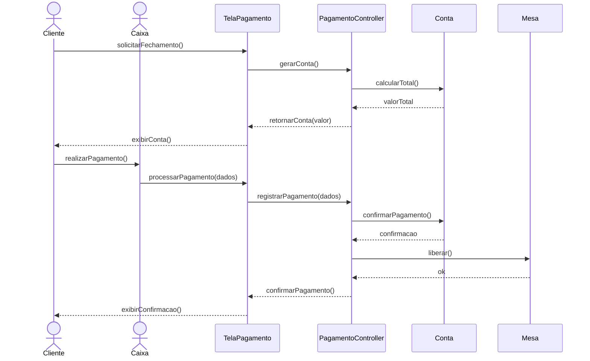
```mermaid
sequenceDiagram
    actor Cliente
    actor Caixa
    participant TelaPagamento
    participant PagamentoController
    participant Conta
    participant Mesa

    Cliente->>TelaPagamento: solicitarFechamento()
    TelaPagamento->>PagamentoController: gerarConta()
    PagamentoController->>Conta: calcularTotal()
    Conta-->>PagamentoController: valorTotal
    PagamentoController-->>TelaPagamento: retornarConta(valor)
    TelaPagamento-->>Cliente: exibirConta()
    Cliente->>Caixa: realizarPagamento()
    Caixa->>TelaPagamento: processarPagamento(dados)
    TelaPagamento->>PagamentoController: registrarPagamento(dados)
    PagamentoController->>Conta: confirmarPagamento()
    Conta-->>PagamentoController: confirmacao
    PagamentoController->>Mesa: liberar()
    Mesa-->>PagamentoController: ok
    PagamentoController-->>TelaPagamento: confirmarPagamento()
    TelaPagamento-->>Cliente: exibirConfirmacao()
```

### 9.7. UC07 — Gerar Relatório de Vendas

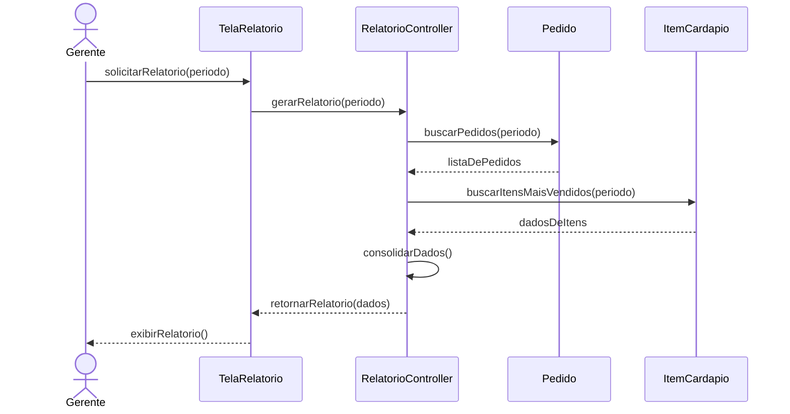
```mermaid
sequenceDiagram
    actor Gerente
    participant TelaRelatorio
    participant RelatorioController
    participant Pedido
    participant ItemCardapio

    Gerente->>TelaRelatorio: solicitarRelatorio(periodo)
    TelaRelatorio->>RelatorioController: gerarRelatorio(periodo)
    RelatorioController->>Pedido: buscarPedidos(periodo)
    Pedido-->>RelatorioController: listaDePedidos
    RelatorioController->>ItemCardapio: buscarItensMaisVendidos(periodo)
    ItemCardapio-->>RelatorioController: dadosDeItens
    RelatorioController->>RelatorioController: consolidarDados()
    RelatorioController-->>TelaRelatorio: retornarRelatorio(dados)
    TelaRelatorio-->>Gerente: exibirRelatorio()
```

## 10. Diagramas de Objetos

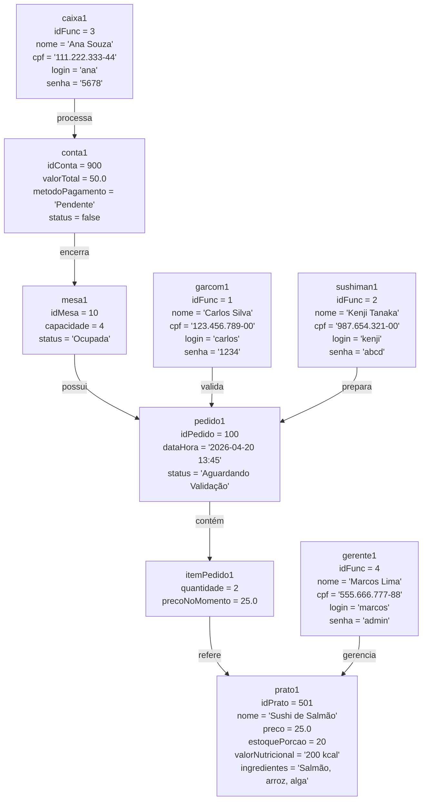
```mermaid
flowchart TD
    caixa1["caixa1<br/>idFunc = 3<br/>nome = 'Ana Souza'<br/>cpf = '111.222.333-44'<br/>login = 'ana'<br/>senha = '5678'"]
    conta1["conta1<br/>idConta = 900<br/>valorTotal = 50.0<br/>metodoPagamento = 'Pendente'<br/>status = false"]
    mesa1["mesa1<br/>idMesa = 10<br/>capacidade = 4<br/>status = 'Ocupada'"]
    garcom1["garcom1<br/>idFunc = 1<br/>nome = 'Carlos Silva'<br/>cpf = '123.456.789-00'<br/>login = 'carlos'<br/>senha = '1234'"]
    sushiman1["sushiman1<br/>idFunc = 2<br/>nome = 'Kenji Tanaka'<br/>cpf = '987.654.321-00'<br/>login = 'kenji'<br/>senha = 'abcd'"]
    pedido1["pedido1<br/>idPedido = 100<br/>dataHora = '2026-04-20 13:45'<br/>status = 'Aguardando Validação'"]
    itemPedido1["itemPedido1<br/>quantidade = 2<br/>precoNoMomento = 25.0"]
    gerente1["gerente1<br/>idFunc = 4<br/>nome = 'Marcos Lima'<br/>cpf = '555.666.777-88'<br/>login = 'marcos'<br/>senha = 'admin'"]
    prato1["prato1<br/>idPrato = 501<br/>nome = 'Sushi de Salmão'<br/>preco = 25.0<br/>estoquePorcao = 20<br/>valorNutricional = '200 kcal'<br/>ingredientes = 'Salmão, arroz, alga'"]

    caixa1 -- processa --> conta1
    conta1 -- encerra --> mesa1
    mesa1 -- possui --> pedido1
    garcom1 -- valida --> pedido1
    sushiman1 -- prepara --> pedido1
    pedido1 -- contém --> itemPedido1
    itemPedido1 -- refere --> prato1
    gerente1 -- gerencia --> prato1
```

## 11. Matriz de Rastreabilidade

**Nome do Projeto:** Restaurante Sakura
**Descrição do Projeto:** Sistema de gerenciamento de Restaurante

| ID | Descrição dos Requisitos | UC1 | UC2 | UC3 | UC4 | UC5 | UC6 | UC7 | UC8 | UC9 | UC10 | UC11 |
|----|---|:-:|:-:|:-:|:-:|:-:|:-:|:-:|:-:|:-:|:-:|:-:|
| R1 | Cadastrar cardápio | | | | | | | | | | | X |
| R2 | Consultar cardápio com categorias | X | | | | | | | | | | |
| R3 | Realizar pedidos via garçom | | X | | | | | | | | | |
| R4 | Validar disponibilidade de itens | | X | | | | | | | X | | |
| R5 | Notificar cozinha sobre novos pedidos | | | X | | | | | | | | |
| R6 | Atualizar status de preparo dos pedidos | | | | | X | | | | | | |
| R7 | Gerenciar cadastro de clientes | | | | | | X | | | | | |
| R8 | Processar pagamentos (cartão/dinheiro/PIX) | | | | | | | X | | | | |
| R9 | Registrar compras de insumos | | | | | | | | X | | | |
| R10 | Controlar estoque (entradas/saídas) | | | | | | | | | X | | |
| R11 | Gerenciar entregas delivery | | | | | | | | | | X | |
| R12 | Controlar fluxo de entregadores | | | | | | | | | | X | X |
| R13 | Tempo de resposta < 3 segundos | X | X | X | X | X | X | X | X | X | X | X |
| R14 | Backup automático diário | X | X | X | X | X | X | X | X | X | X | X |
| R15 | Autenticação obrigatória | | | | | | X | X | X | X | X | X |
| R16 | Dados criptografados em transações | | | | | | X | | | | | |

> **Nota de revisão:** esta matriz usa a numeração genérica **UC1–UC11**, que não corresponde aos casos de uso UC01–UC07 definidos nas seções 5 e 7 deste documento (não há, por exemplo, "Gerenciar cadastro de clientes" ou "Gerenciar entregas delivery" no escopo do Sakura — delivery e cadastro de cliente nem aparecem no Minimundo). A reprodução acima preserva exatamente os marcadores e a posição das colunas conferidos no PDF original; recomenda-se reconstruir esta matriz mapeando R1–R16 diretamente para UC01–UC07 antes da entrega final.

## 12. Implementação de Padrões de Projeto

A adoção estratégica de padrões de projeto, conforme propostos por Gamma et al. (1994) no clássico *Design Patterns: Elements of Reusable Object-Oriented Software*, eleva a qualidade arquitetural do Sakura Management System, promovendo coesão, baixo acoplamento e manutenibilidade. No contexto da MDA, esses padrões atuam como pontes entre o PIM e o PSM, traduzindo abstrações UML em implementações concretas e reutilizáveis.

### 12.1. State — transições de status de `Pedido`

Gerencia as transições dinâmicas de estado em entidades críticas, como `Mesa` (RN02) e `Pedido` (RN05, RN06). A classe `Pedido` delega comportamento ao estado atual via composição, eliminando condicionais complexas e suportando o bloqueio por falha de conexão descrito no CIM.

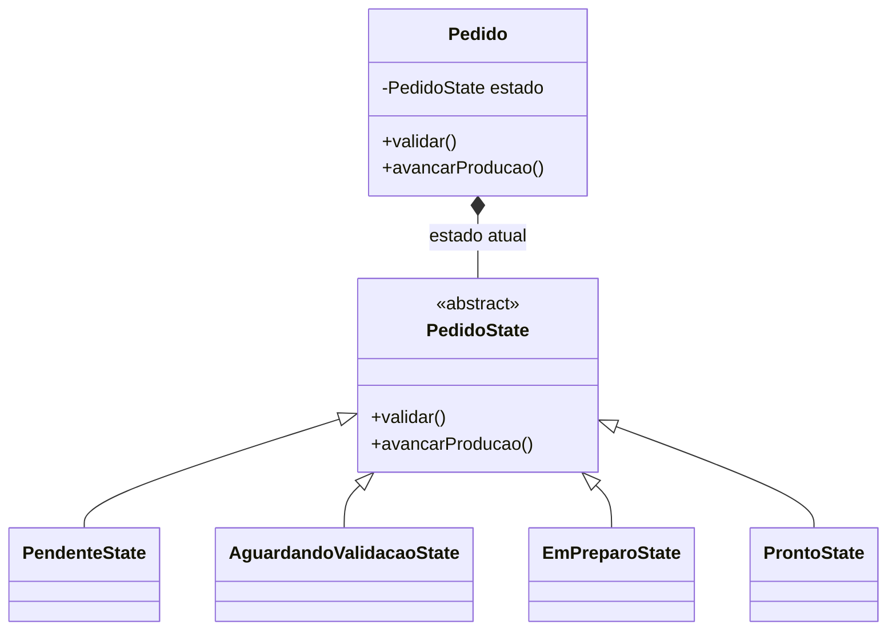
```mermaid
classDiagram
    class Pedido {
        -PedidoState estado
        +validar()
        +avancarProducao()
    }
    class PedidoState {
        <<abstract>>
        +validar()
        +avancarProducao()
    }
    class PendenteState
    class AguardandoValidacaoState
    class EmPreparoState
    class ProntoState
    PedidoState <|-- PendenteState
    PedidoState <|-- AguardandoValidacaoState
    PedidoState <|-- EmPreparoState
    PedidoState <|-- ProntoState
    Pedido *-- PedidoState : estado atual
```

### 12.2. Observer — notificações em tempo real

Assegura sincronização entre terminais para chamadas de "Ajuda" (RN03), alertas de "Pronto" (RN07) e atualizações de cardápio (RN09, UC04). No PSM, a integração com WebSockets dispara esses eventos de forma assíncrona.

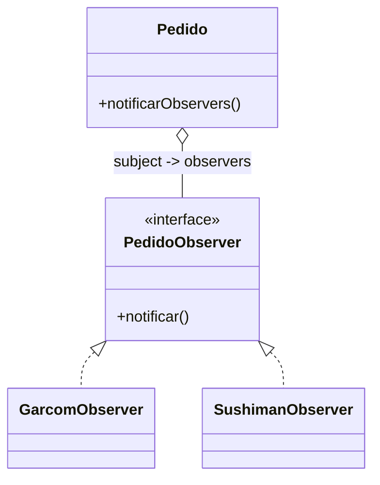
```mermaid
classDiagram
    class Pedido {
        +notificarObservers()
    }
    class PedidoObserver {
        <<interface>>
        +notificar()
    }
    class GarcomObserver
    class SushimanObserver
    PedidoObserver <|.. GarcomObserver
    PedidoObserver <|.. SushimanObserver
    Pedido o-- PedidoObserver : subject -> observers
```

### 12.3. Strategy — meios de pagamento

Permite o processamento financeiro flexível (RN12, UC06). A classe `Conta` injeta a estratégia via construtor, suportando fechamentos parciais ou divididos sem alterar seu núcleo.

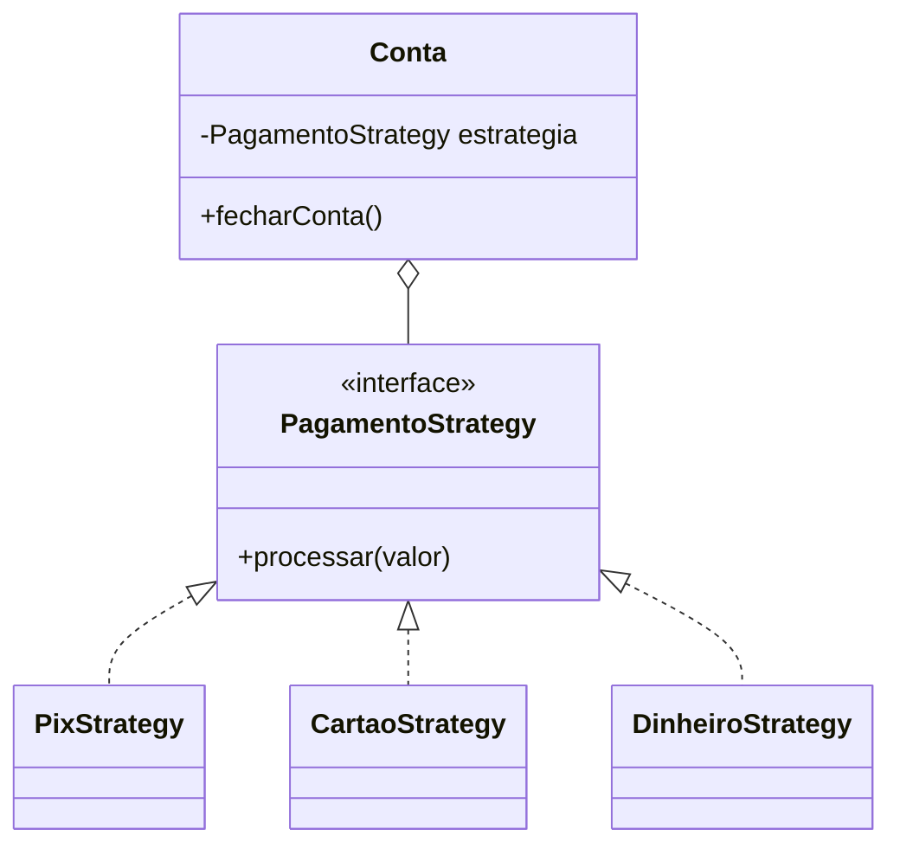
```mermaid
classDiagram
    class Conta {
        -PagamentoStrategy estrategia
        +fecharConta()
    }
    class PagamentoStrategy {
        <<interface>>
        +processar(valor)
    }
    class PixStrategy
    class CartaoStrategy
    class DinheiroStrategy
    PagamentoStrategy <|.. PixStrategy
    PagamentoStrategy <|.. CartaoStrategy
    PagamentoStrategy <|.. DinheiroStrategy
    Conta o-- PagamentoStrategy
```

### 12.4. Command — operações auditáveis

Encapsula operações auditáveis, como validação de estoque (RN05), baixa automática de insumos (RN08) e ajustes manuais (RN10, UC05). Comandos concretos são enfileirados em uma `KDSQueue` (UC03), suportando desfazer e auditoria gerencial (UC07).

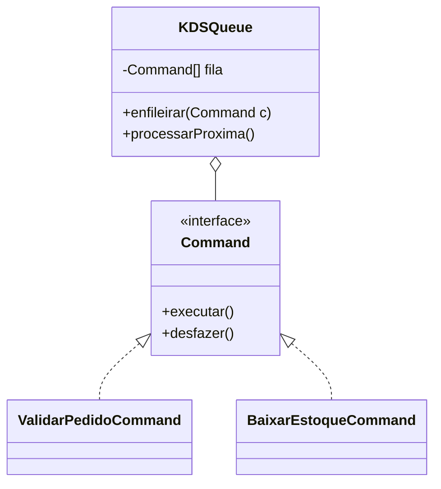
```mermaid
classDiagram
    class Command {
        <<interface>>
        +executar()
        +desfazer()
    }
    class ValidarPedidoCommand
    class BaixarEstoqueCommand
    class KDSQueue {
        -Command[] fila
        +enfileirar(Command c)
        +processarProxima()
    }
    Command <|.. ValidarPedidoCommand
    Command <|.. BaixarEstoqueCommand
    KDSQueue o-- Command
```

### 12.5. Decorator — promoções no cardápio

Enriquece dinamicamente o `ItemCardapio` (UC04), permitindo adicionar promoções ou sazonalidades sem herança rígida. Um `PromocaoDecorator` envolve o item base, recalculando preço e disponibilidade em tempo real (RN09).

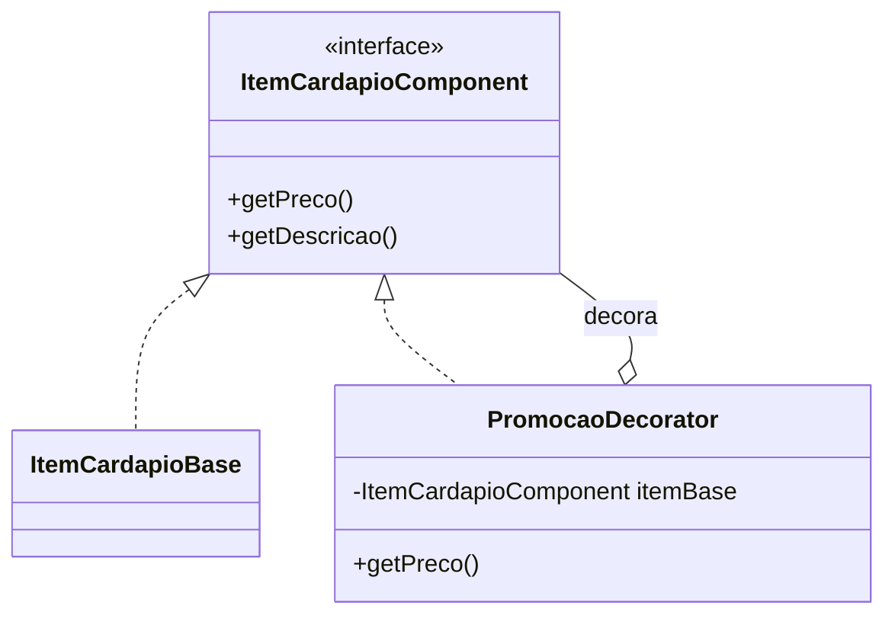
```mermaid
classDiagram
    class ItemCardapioComponent {
        <<interface>>
        +getPreco()
        +getDescricao()
    }
    class ItemCardapioBase
    class PromocaoDecorator {
        -ItemCardapioComponent itemBase
        +getPreco()
    }
    ItemCardapioComponent <|.. ItemCardapioBase
    ItemCardapioComponent <|.. PromocaoDecorator
    PromocaoDecorator o-- ItemCardapioComponent : decora
```

A implementação desses padrões não apenas mitiga riscos identificados na modelagem — como ambiguidades em estados e notificações —, mas também eleva a reusabilidade, alinhando-se aos princípios SOLID. No PSM, frameworks como Flutter facilitam sua orquestração, com testes unitários validados contra os fluxos textuais dos UCs. Assim, o Sakura Management System transcende a mera modelagem UML, consolidando uma arquitetura robusta e evolutiva.

## 13. Conclusão

A elaboração deste projeto de modelagem para o Sakura Management System demonstrou que o desenvolvimento de um software de qualidade é, acima de tudo, uma questão de arquitetura, processos e ferramentas. Ao longo das etapas de definição do mini-mundo, levantamento de requisitos, diagramas de casos de uso e estruturação das classes, o objetivo foi compreender melhor o sistema que está sendo elaborado antes de iniciar a codificação.

A utilização da linguagem UML foi fundamental para padronizar a comunicação e a organização do problema, permitindo que a complexidade do restaurante físico fosse particionada em visões complementares. Os principais benefícios alcançados com este processo de modelagem incluem:

- **Redução de Riscos e Erros:** a modelagem permitiu identificar falhas de comunicação e ambiguidades logo na fase inicial, evitando que erros de requisitos se propagassem para a implementação.
- **Abstração e Foco no Negócio:** através da abstração, isolamos os aspectos críticos da operação do Sakura — como o controle rigoroso de estoque e a validação de pedidos — suprimindo detalhes técnicos irrelevantes neste nível.
- **Arquitetura Flexível:** a adoção da orientação a objetos resultou em uma estrutura centrada na interação entre classes (como Mesa, Pedido e ItemCardapio), garantindo um sistema com manutenção mais fácil e altamente adaptável a modificações futuras.
- **Qualidade e Reusabilidade:** o uso de herança, composição e polimorfismo no diagrama de classes promoveu a coesão e reduziu o acoplamento, bases essenciais para a qualidade do produto final.

Em suma, a modelagem baseada em objetos aqui apresentada não é apenas um conjunto de diagramas, mas uma simplificação da realidade que fornece um guia preciso para a construção do software. Com esta base documental sólida, o Sakura Management System está preparado para ser implementado com maior confiabilidade, garantindo que a tecnologia atende plenamente às necessidades operacionais e de gestão do restaurante.

## 14. Referências

- DEVMEDIA. *Modelagem de software com UML*. [S.l.], 2011. Disponível em: https://www.devmedia.com.br. Acesso em: 14 mar. 2026.
- ESPÍNDOLA, Evandro Camarini. *A importância do Modelagem de Objetos no Desenvolvimento de Sistemas*. Linha de Código, 2026. Disponível em: http://www.linhadecodigo.com.br. Acesso em: 14 mar. 2026.
- EXERCÍCIO: e-Restaurante (Enunciado e Modelo de Caso de Uso). [S.l.: s.n., s.d.].
- FURTADO, Gustavo. *A primeira fase de um projeto de banco de dados*. Dicas de Programação, 2023. Disponível em: https://dicasdeprogramacao.com.br. Acesso em: 15 mar. 2026.
- GAMMA, E. et al. *Design Patterns: Elements of Reusable Object-Oriented Software*. Addison-Wesley, 1994.
- KHAN, Qasim. *Use Case Diagram for Restaurant Management System*. EdrawMax, 2025. Disponível em: https://www.edrawmax.com/templates/. Acesso em: 15 mar. 2026.
- ROCHA, Rafael. *Mini-mundo - exemplo prático*. Alura, 2024. Disponível em: https://cursos.alura.com.br/forum. Acesso em: 15 mar. 2026.
- SABIL, Tusamma Sal. *Design a Restaurant Management System*. GitHub, 2020. Disponível em: https://github.com/wyaadarsh/Grokking-OOD. Acesso em: 15 mar. 2026.
- SILVA-DE-SOUZA, Thiago. *Model Driven Architecture – Conceitos Fundamentais*. Linha de Código, [s.d.]. Disponível em: http://www.linhadecodigo.com.br. Acesso em: 15 mar. 2026.
- UML. In: WIKIPÉDIA: a enciclopédia livre. [S.l.]: Wikimedia Foundation, 2025. Disponível em: https://pt.wikipedia.org/wiki/UML. Acesso em: 15 mar. 2026.